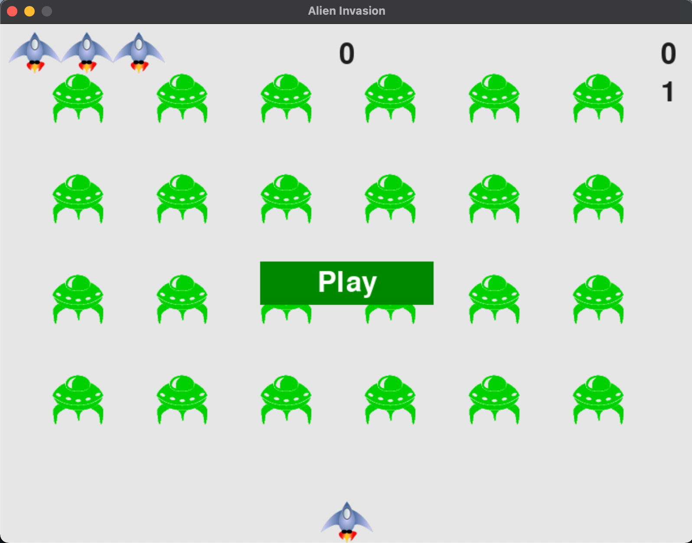

# 项目介绍
这是一款利用 pygame 开发的《外星人入侵》小游戏


## 游戏说明


- 鼠标点击【Play】或者按下 P 键开始游戏，按下 Q 键则退出游戏
- 屏幕左上角显示剩余飞船数量
- 屏幕顶部中央数字显示最高分
- 屏幕顶部最右边数字显示当前玩家得分
- 屏幕顶部往下一行最右边数字显示当前游戏难度等级


## 运行
```
python3 alien_invasion.py
```